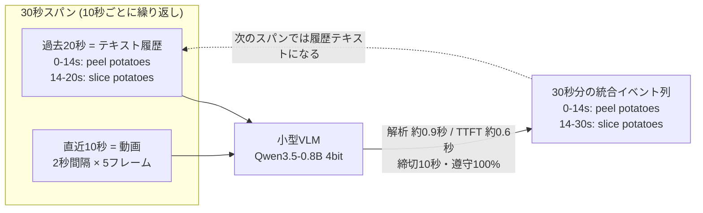

# rtva — Real-Time Video Analysis with Small VLMs

**届き続ける映像を、遅れずに解析し続ける。** エッジで動く小型VLM（Qwen3.5-0.8B, 4bit / MLX /
Apple Silicon）で、一人称視点の作業動画からタイムスタンプ付きイベント区間を
リアルタイムに出力し続ける実験基盤。

入力は**「結構前の分はテキスト、直近だけ動画」**:



出力はタイムスタンプ付きイベント区間のJSON:

```json
{"events": [{"start_s": 0,  "end_s": 14, "step": "peel potatoes"},
            {"start_s": 14, "end_s": 30, "step": "slice potatoes"}]}
```

長時間動画をそのままモデルに入れることはできない。**ピクセルで見るのは直近だけ、
それ以前は検出結果のテキスト**として与えることで、どれだけ長く流してもコンテキストが
一定に保たれる。学習させる本質は「接合」— テキスト最後のイベントが動画内で継続して
いるのか、新しいステップに切り替わったのかの判定と統合。

## セットアップ

```bash
# 推論・学習: mlx-vlm 0.6.3 (Apple Silicon / MLX)。別venvで:
uv venv .venv-vlm && uv pip install --python .venv-vlm/bin/python "mlx-vlm==0.6.3"
# 補助 (データ処理):
uv venv .venv && uv pip install --python .venv/bin/python opencv-python-headless datasets

# 1. アノテーション取得 (ライセンス不要)
bash scripts/fetch_annotations.sh
# 2. 動画取得 (Ego4Dライセンスが必要: ego4ddataset.com で申請。
#    コマンドは scripts/fetch_annotations.sh 内のコメント参照)
# 3. 動画選定 (data/manifest.json を生成) → フレーム抽出 (1fps)
.venv/bin/python scripts/select_videos.py --train 20 --valid 5
.venv/bin/python scripts/extract_frames.py
```

## 実験パイプライン

```bash
# データ生成 (train 900 / valid 396。境界系を増強・履歴に±2秒ジッタ)
.venv/bin/python scripts/make_span_data.py

# zero-shot ベースライン
.venv-vlm/bin/python scripts/eval_windows.py --window 30 \
    --data data/goalstep/sft_span/validation_eval.jsonl \
    --max-pixels 112896 --out runs/eval-zeroshot-span.json

# QLoRA 学習 (Vision凍結 / Projectorフル / LLM LoRA。約4時間。--dry-run で構成検証のみ)
caffeinate -is .venv-vlm/bin/python -u scripts/train.py \
    --dataset data/goalstep/sft_span --max-image-pixels 112896 \
    --output-path training_runs/span/adapters.safetensors \
    2>&1 | tee training_runs/span/train.log

# 学習後評価 (同一条件) → 区間別・カテゴリ別の分析
.venv-vlm/bin/python scripts/eval_windows.py --window 30 \
    --data data/goalstep/sft_span/validation_eval.jsonl \
    --max-pixels 112896 --adapter training_runs/span --out runs/eval-sft-span.json
.venv-vlm/bin/python scripts/analyze_span.py runs/eval-*.json

# 自己履歴ストリーミング (履歴を自分の過去出力から構築する本番条件)
.venv-vlm/bin/python scripts/eval_stream.py --adapter training_runs/span \
    --out runs/eval-stream.json

# デモ動画 (左=動画+判定タイムライン / 右=トークンストリーミング実測再生)
.venv-vlm/bin/python scripts/demo_record.py --uid <uid> --start <秒> --windows 3 \
    --span 30 --window 10 --max-pixels 112896 --adapter training_runs/span \
    --out runs/demo/rec.jsonl
.venv/bin/python scripts/demo_render.py runs/demo/rec.jsonl out/demo.mp4
```

窓タスク（W=5秒）も同じ評価系で再現できる:
`make_window_data.py` → `eval_windows.py`（`--window 5`・既定データパス）→ `train.py`。

## 学習設定とその理由

**QLoRA: 4bit凍結ベース + 学習対象2.7%（23M）**。24GB機のメモリ実績域
（学習ピーク約13GB・系列約1,300トークン）に収めるための構成:

| 部位 | 扱い | 理由 |
|---|---|---|
| Vision Encoder | **凍結** | 小データSFT(900例)でViTを動かすと表現を壊しやすい（LLaVA・Qwen2.5-VL等もSFT段はViT凍結が通例）。視覚エラーが支配的と判明した場合のみ `--vision-lora` を積む増強ラダー |
| Projector (merger) | **フル学習** | 視覚特徴→LLM空間の橋渡し。非量子化fp16の6モジュールだけなのでコスト最小・タスク適応の効果大 |
| LLM | **LoRA r16 α32** | タスクの本質（履歴統合・時刻計算・JSON形式・語彙の言い換え耐性）は言語側のスキル。学習容量の大半をここに割く |

損失は応答部分のみ（`train_on_completions`）。画像は1フレーム108トークン
（336²相当・`rtva/imaging.py` で制御）×5フレーム。プロンプトはSFTと推論で完全同一。

**フレームの時間表現について**: 5フレームは独立画像として入力しており、M-RoPE
（時間×高さ×幅の3D位置）は各フレームに t=1 で適用される。フレーム間の順序は
共有時間軸ではなく系列内の並び+プロンプトの "in chronological order" で伝えている。
`video_grid_thw` による時間軸共有の動画モードは mlx-vlm 0.6.3 の学習パスで
未検証のため未使用（将来の増強候補）。

## 実測値（M4 Pro 24GB・スパンタスク・valid 396スパン）

| 項目 | zero-shot | SFT後(オラクル履歴) | SFT後(自己履歴) |
|---|---|---|---|
| 秒単位正解率 | 10.4% | **88.6%** | 9.7% |
| イベントF1 (tIoU≥0.5) | 3.2% | **81.9%** | 0.0% |
| TTFT / 解析時間 | — | 約0.6s / 約0.9s（締切10s） | 同左 |
| 締切遵守率 | 100% | 100% | 100% |

学習は約15秒/例・ピーク12.8GB（900例1エポック≈4時間）。スキル分解では、
履歴テキストの統合(98.5%)と継続イベントの接合(91.6%)は獲得した一方、
**動画内で新たに始まるイベントの検出は1.5%**にとどまる。このため履歴を自己出力で回す
ストリーミングではコールドスタート（最初の検出の立ち上げ）に失敗する — これが次の課題。
手法の理論上限はオラクル予測器で秒99.4% / F1 95.7%（`eval_stream.py --mock-oracle`）。

## 構成

```
rtva/               コアライブラリ
  goalstep.py       Ego4D GoalStep アダプタ (タイムライン・語彙・manifest)
  windows.py        窓の切り出し/分類/マージ
  prompts.py        プロンプト (SFTと推論で完全同一)
  parsing.py        出力JSONの検証つきパース
  metrics.py        秒単位正解率 / イベントP・R・F1(tIoU) / 境界MAE
  imaging.py        画像トークン数の実効制御 (processor実装差の回避)
scripts/            薄い実行スクリプト (fetch/select/extract/make/train/eval/demo)
data/manifest.json  使用動画の選定結果 (select_videos.py が生成)
data/ runs/ training_runs/ out/   実体データと成果物 (gitignore)
```

## データ

[Ego4D GoalStep](https://github.com/facebookresearch/ego4d-goalstep)（料理中心の一人称動画・
step区間の密なアノテーション）。クリーン条件（カバレッジ0.85+・区間重複なし・5〜20分・
語彙6種+）で **train 20本 + valid 5本（計313分）** を選定。1fps・540p で使用。

- 評価セットは非重複スパン・オラクル履歴（ノイズなし）。学習には使わない
- モデル: `mlx-community/Qwen3.5-0.8B-MLX-4bit`（重み1.16GB・推論常駐≈1.5GB）

## 制約・既知の問題

- mlx-vlm 0.6.3 / transformers の学習・前処理には問題が5件あり
  （マルチ画像collation / Gated DeltaNetカーネル / fused M-RoPE のVJP未実装 /
  MLXバッファキャッシュ蓄積によるMetal OOM / ImageProcessor実装による `max_pixels` 無視）、
  回避を `scripts/train.py` と `rtva/imaging.py` に同梱
- 画像トークン数は必ず `rtva.imaging.set_max_image_pixels` で制御する
  （`.max_pixels` 属性は実装によって無視され、系列長が想定の2倍になりOOMする）
- Ego4D 動画はライセンスが必要（annotations は不要）。データ実体はGitに含まれない

## 関連研究

- [ProVideLLM — Memory-efficient Streaming VideoLLMs for Real-time Procedural Video
  Understanding](https://arxiv.org/abs/2504.13915): 過去フレームを「動詞化」した
  言語トークンに圧縮し（1時間→平均630トークン）、直近8〜16秒だけを視覚トークンで
  保持するストリーミングVideoLLM。Ego4D GoalStep を含むオンラインステップ検出で検証。
  本リポジトリの「過去=テキスト・直近=動画」と同じ発想を専用アーキテクチャ
  （DETR-QFormer・インターリーブKVキャッシュ）で実装したもので、本実験は同じ設計思想を
  **既製の小型VLM + QLoRA + プロンプト設計だけ**でどこまで実現できるかの検証に相当する。

## License

MIT（コード）。データは Ego4D License / GoalStep (Apache-2.0 annotations) に従う。
